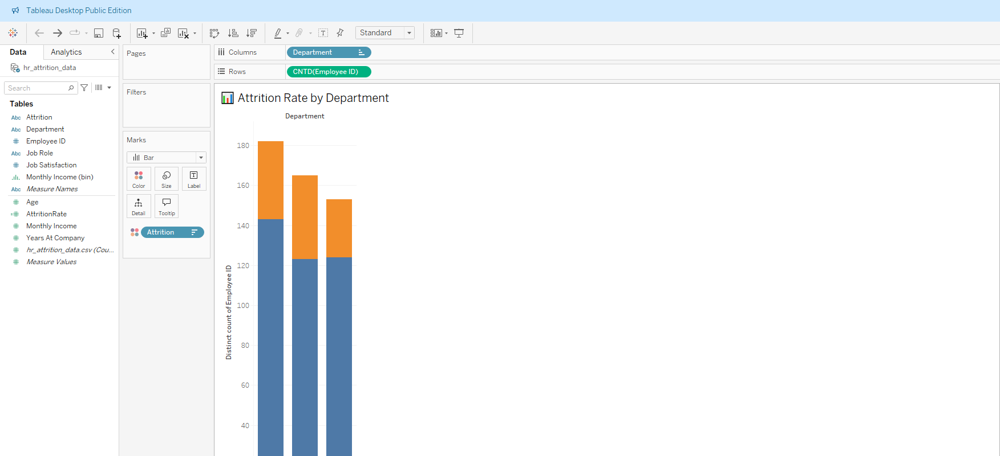
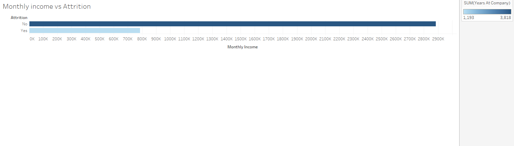
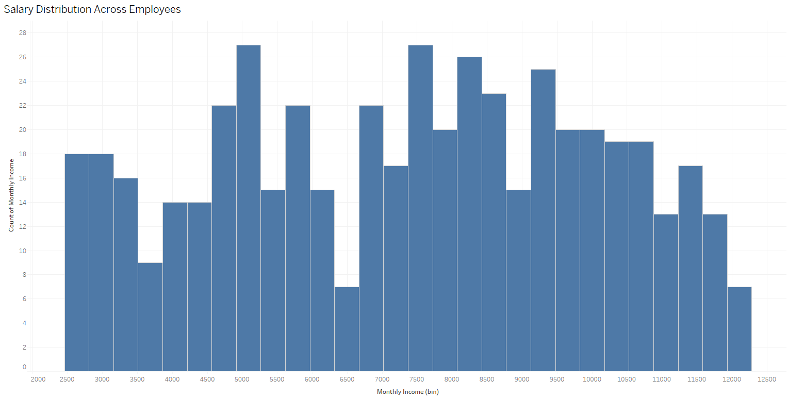
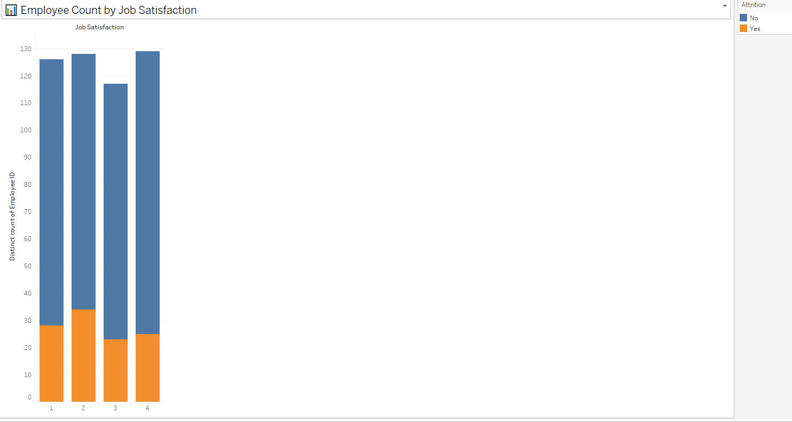
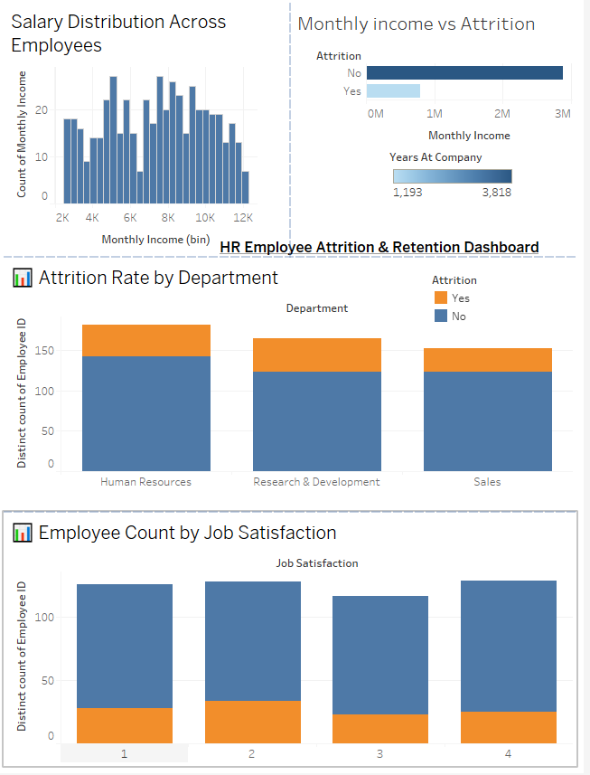

# 📊 HR Employee Attrition & Retention Analysis (Google Data Analytics Capstone)

This project explores employee attrition data to uncover patterns that help HR professionals understand why employees leave, which departments are most affected, and how salary and satisfaction levels contribute to turnover. It was completed as part of the Google Data Analytics Capstone to showcase real-world data storytelling using SQL, Excel, and Tableau.

---

## 🚀 Project Goal

Help companies reduce employee attrition by identifying the key drivers behind turnover and developing data-informed retention strategies.

---

## 🔍 Key Questions Answered

- Which departments and roles experience the most attrition?
- Does higher salary reduce employee turnover?
- Are employees with low job satisfaction more likely to leave?

---

## 🛠 Tools & Skills Used

| Tool      | Purpose                                |
|-----------|-----------------------------------------|
| **SQL (BigQuery)** | Data cleaning and trend analysis |
| **Excel**          | Initial data preprocessing        |
| **Tableau**        | Visual analytics & dashboards     |

---

## 📂 Dataset Summary

- **File:** `hr_attrition_data.csv`
- **Records:** 500 employees
- **Columns:**
  - `EmployeeID`: Unique ID
  - `Department`: Department name
  - `JobRole`: Job title
  - `MonthlyIncome`: Employee salary
  - `YearsAtCompany`, `Age`, etc.
  - `JobSatisfaction`: Score from 1 (low) to 4 (high)
  - `Attrition`: "Yes" or "No" (left the company)

---

## 🧮 SQL Scripts Included

- `data_cleaning.sql`: Cleans missing or incorrect values
- `attrition_analysis.sql`: Highlights high-attrition departments
- `employee_retention.sql`: Examines pay and satisfaction trends

---

## 📊 Tableau Visualizations

### 📉 Attrition by Department

### 💰 Salary vs Attrition

### 📊 Salary Distribution

### 🙂 Job Satisfaction vs Attrition

---

### 🌐 Final Dashboard Overview

> *(Dashboard created in Tableau: `HR_Attrition_Analysis.twbx`)*

---

## 📌 Key Insights

- The **Sales** and **HR** departments have the highest attrition rates
- Employees with **low job satisfaction (1–2)** are far more likely to leave
- **Salary influences retention** early on, but impact levels off over time

---

## 🧪 How to Recreate This Project

1. Clone/download this repo
2. Open `.sql` scripts in BigQuery to explore queries
3. Use the dataset (`.csv`) in Excel or Tableau
4. Open the Tableau workbook (`.twbx`) to view the full dashboard

---

## 🔮 Future Enhancements

- Add machine learning to predict attrition risk
- Include features like promotions, overtime, and job level
- Expand survey data on work-life balance and stress levels

---

## 👤 Author

**Akash Pandya**  
Freelance Data Analyst | SQL, Tableau, Excel  
[Portfolio Website](https://aakashpandya.netlify.app/) • [GitHub](https://github.com/akashpandya) • [LinkedIn](https://www.linkedin.com/in/akash-pandya100/)

---
